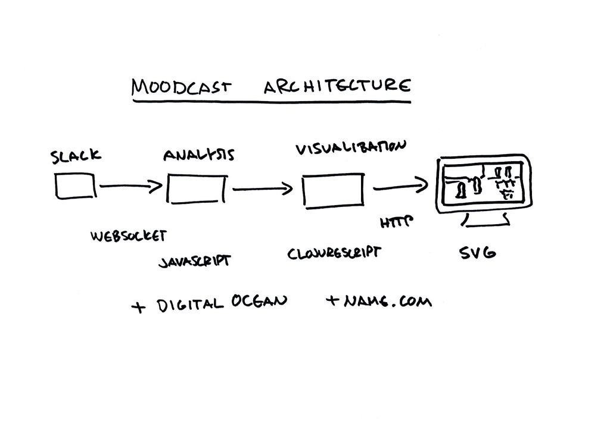

# MoodCast

## Inspiration

Growing emotional disconnection in working environments.

## What it does

It uses internal communication data to analyze the emotions of the members of the working environment and uses it to create a live cast of emotions and moods to the rest of the users.

## What it allows you to do

- Bring disperse organizations together: ideal for fast-growing working environments and spatially dispersed organizations.
- Cast and share your moods to your co-workers in a customizable manner.
- Find the relevant emotions and define them in a relevant way to your working environments with the InterMoods tool.
- Use the Moodschedule tools to organize work and other collective activities based on MoodCast data.

## How we built it

- We read messages in Emotion Hack Day slack channel using the Slack API and Websockets.
- The emoticons and chat messages are analyzed, and transformed to emotional states.
- The emotions are visualized using SVG avatars in a ClojureScript Single Page App.
- The final result is seen online in DigitalOcean at http://moodcast.rocks



## Development Mode

### Compile css:

Compile css file once.

```
lein garden once
```

Automatically recompile css file on change.

```
lein garden auto
```

### Run application:

```
lein clean
lein figwheel dev
```

Figwheel will automatically push cljs changes to the browser.

Wait a bit, then browse to [http://localhost:3449](http://localhost:3449).

## Production Build

```
lein clean
lein cljsbuild once min
```

## Production deployment

```
ssh root@moodcast.rocks (using public key)

cd moodcast-ui
nohup ./lein run dev
```

Also you may need to `scp` files or `lein garden once` to build the CSS files.

